<!--
  ╔══════════════════════════════════════════════════════════════════╗
  ║  ABDUL MAJID JAMIL · SOC-After-Dark profile · cyber theme          ║
  ║  Custom animated SVGs live in /assets and render on GitHub.        ║
  ║  Service cards use username: AbdulMajidjamil  (edit if different)  ║
  ╚══════════════════════════════════════════════════════════════════╝
-->

<!-- ░░░░░░░░░░░░░░░░░░░░  HERO  ░░░░░░░░░░░░░░░░░░░░ -->

  

<!-- ░░░░░░░░░░░░░░░░░░░░  TYPING TAGLINE  ░░░░░░░░░░░░░░░░░░░░ -->

  

<!-- ░░░░░░░░░░░░░░░░░░░░  CONNECT  ░░░░░░░░░░░░░░░░░░░░ -->

  
  
  
  
  

<!-- ░░░░░░░░░░░░░░░░░░░░  WHOAMI  ░░░░░░░░░░░░░░░░░░░░ -->
### `> ./whoami`

I'm a **cybersecurity & infrastructure security professional** securing critical
healthcare infrastructure as an **IT Security Specialist at SICVD** — building
Active Directory & RBAC from scratch, running VAPT, and hardening networks across
**11 linked hospital sites**.

Beyond the day job, I founded **Pakistan Cyber Security & Digital Forensics (PCSDF)**
to make practical security education real — CTFs, hands-on labs, and a strong push
for **women & youth inclusion** in cyber.

- 🛡️ **Now:** IT Security Specialist · Sindh Institute of Cardiovascular Diseases
- 🔬 **Research:** AI-driven defense · cloud SIEM (Wazuh) · adversarial ML
- 🎓 **Learning:** advancing offensive security & DFIR tradecraft
- 🎤 **Speaking:** cyber-hygiene, data privacy & digital safety
- 🤝 **Open to:** research partnerships, training, speaking & security consulting

 

<!-- ░░░░░░░░░░░░░░░░░░░░  ARSENAL  ░░░░░░░░░░░░░░░░░░░░ -->
### `> cat arsenal.txt`

**🔴 Offensive Security & VAPT**

**🔵 Blue Team · SOC · DFIR**

**🟢 Infrastructure · Identity · Network**

**⚙️ Languages & Tooling**

<!-- ░░░░░░░░░░░░░░░░░░░░  CERTS  ░░░░░░░░░░░░░░░░░░░░ -->
### `> ls -la certifications/`

-1D2B64?style=for-the-badge&logo=verizon&logoColor=22D3EE)

 
-0B6E4F?style=for-the-badge&logo=letsencrypt&logoColor=white)

<b>📜 Expand full certification log (40+ credentials)</b>

- **OPSWAT Academy** — OT Security Expert (OOSE), Siemens & Schneider PLC Secure Configuration Expert, Introduction to Critical Infrastructure Protection (ICIP)
- **Certified Online Fraud Prevention Specialist (COFPS)** — Hack & Fix Academy
- **Federal Judicial Academy Islamabad** — E-Course for Law Professionals 2026
- **CISSP – Foundations** · InfoSec4TC
- **Information Security: Context & Introduction** · Royal Holloway, University of London
- **Cyber Security Foundation Professional (CSFPC)** · CertiProf
- **Huawei** — HCIA Security · HCIP Datacom (Advanced Routing & Switching)
- **Cisco Networking Academy** — CCNA R&S · Introduction to Cybersecurity · Cybersecurity Essentials
- **TCM Security** — Windows & Linux Privilege Escalation
- **Active Countermeasures** — Cyber Threat Hunting Level 1
- **Cyber Scout** · Cyber Security of Pakistan
- **Udemy** — Web App Penetration Testing (C|WAPT), OSCP Prep, Ethical Hacking (Beginner→Advanced), Malware Analysis & Incident Response, CTF Walkthroughs, Evil-Twin / Wi-Fi attacks, Reverse Engineering, and 15+ more
- **NAVTTC / IBA** — Certificate in Cyber Security
- **Server Virtualization with Hyper-V & System Center** · **Digital Logic Design** · **C.I.T**

<!-- ░░░░░░░░░░░░░░░░░░░░  RESEARCH  ░░░░░░░░░░░░░░░░░░░░ -->
### `> grep -r "publications"`

| Year | Venue | Contribution |
|:----:|:------|:-------------|
| **2026** | ICFAR — Konya, Turkey 🎤 | Adversarial Patch-Based Feature Disruption Attacks on Heterogeneous Deep Learning Architectures for **Network Intrusion Detection** |
| **2026** | ICTAR — Konya, Turkey 🎤 | **CH-FR-PC**: A Unified Cyber Hygiene – Digital Forensic Readiness – Privacy Compliance Metric |
| **2025** | ICSIS — Konya, Turkey | AI-Enhanced Cybersecurity **Maturity Framework** for Pakistani Corporations |
| **2025** | ICMAR — Konya, Turkey | Integrating Cybersecurity Frameworks for **Adaptive IT Defense** |
| **2024** | **IEEE** Conference | Security & Threat Detection via Cloud-Based **Wazuh** Deployment |
| **2016** | ICE Cube | Facial-Controlled Wheelchair using Multilayer Perceptron (Time–Frequency) |

> Active on the **ReCYP:HER** project — adaptive IT-defense strategies & digital forensics.

<!-- ░░░░░░░░░░░░░░░░░░░░  STATS  ░░░░░░░░░░░░░░░░░░░░ -->
### `> systemctl status github`

<!-- Contribution snake — needs the workflow in the setup notes below -->

  

<!-- ░░░░░░░░░░░░░░░░░░░░  PCSDF  ░░░░░░░░░░░░░░░░░░░░ -->
### `> ./pcsdf --mission`

> **Pakistan Cyber Security & Digital Forensics** — practical cyber education, digital-safety
> awareness, and empowering **youth & women** in security. Workshops, CTFs, hands-on labs,
> university programs, and research collaboration — bridging academia and the real threat landscape.

  
  
  

 

<!-- ░░░░░░░░░░░░░░░░░░░░  FOOTER  ░░░░░░░░░░░░░░░░░░░░ -->

  <i>"Security is not a product, but a process — and awareness is its first line of defense."</i>
    
  

